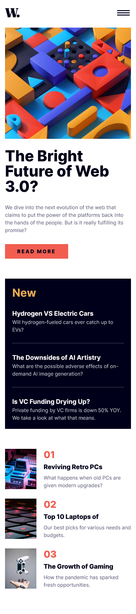
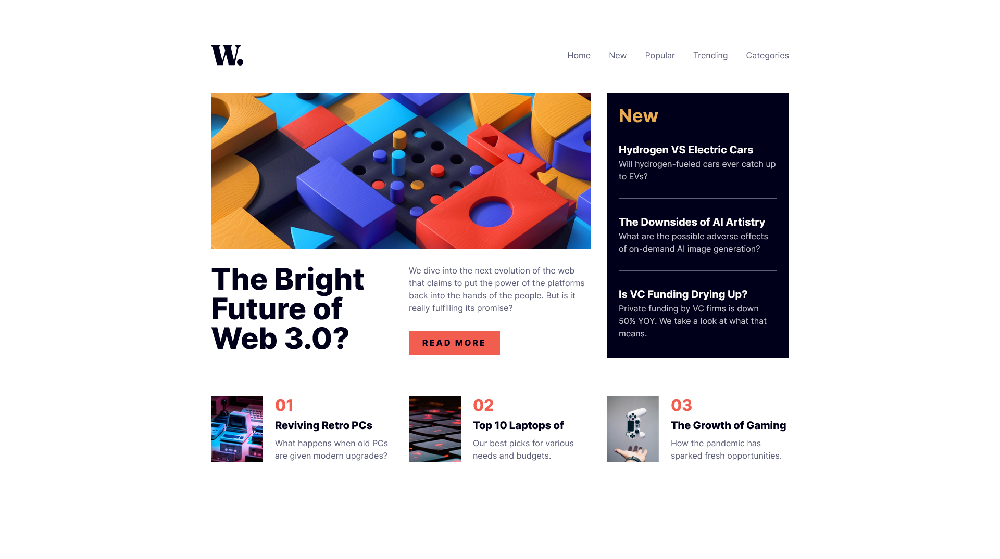

## Overview
This is my solution for front-end mentor challenge name: [News homepage](https://www.frontendmentor.io/challenges/news-homepage-H6SWTa1MFl)

### Screenshot
Mobile view\

desktop view\

### Demo
[click Me]()

### Built with
- Mobile-first workflow
- Semantic HTML5 markup
- CSS custom properties
- JS and jquery

### What I learned 
I learned a little bit  about ARIA and web accessibility and i am still working on improving my skill.

### Author 
[wajidkhan2](https://github.com/wajidkhan2)